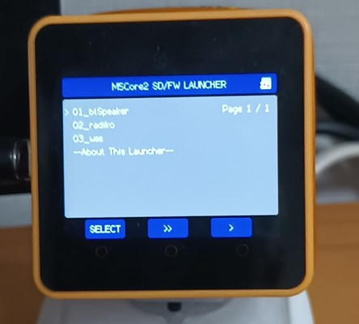

# BinsPack-for-StackChan-Core2

SD-Updaterに対応したスタックチャン(Core2版)のBINファイル集です。 
スタックチャン用ソフト７種とランチャー(menu.bin) ＋ おまけ（１）を同梱しています。

各ソフトの内容は、リンクをご参照ください。

## BINS

"Copy-to-SD"フォルダ下にSDで使用するファイルがあります。 

- [01_btSpeaker.bin](https://github.com/NoRi-230401/SDU-stackchan-bluetooth-simple) 
  Bluetooth Speaker 
 

- [02_radiko.bin](https://github.com/NoRi-230401/SDU-M5Unified_StackChan_Radiko) 
Radiko 
WebRadio Radikoプレイヤー付きのスタックチャン

- [03_wss.bin](https://github.com/NoRi-230401/WebServer-with-stackchan) 
  WebServer-with-Stackchan 
  AiStackChan2相当、サーボ調整、リモコン等たくさんの機能を詰め込みました。  

- [04_whisperMp3.bin](https://github.com/NoRi-230401/SDU-M5Unified_StackChan) 
  stackchan-whisper-mp3 
  スタックチャンが独り言を言います。セリフをSDカードにmp3ファイルで入れておくとランダムに再生します。 
  通信環境(WiFi等)がいらないソフトなので気楽に使えます。デモや販促等で活躍できそうです。 
  mp3のデータファイルと"servo.txt","volume.txt"の設定ファイルを使用します。 
  実行前にSDにコピーが必要です。
  

- [05_AvatarLite.bin](https://github.com/NoRi-230401/SDU-M5Core2ImageAvatarLite) 
  Image Avatar Lite 
独自Avatar開発の為のソフトウエア・ツールです。 
Avatarが、サーボ・LED・bluetoothスピーカ音声とコラボして変化します。 
 

- [06_tester.bin](https://github.com/NoRi-230401/SDU-stack-chan-tester) 
  stack-chan-tester 
  スタックチャンを作成するときに、PWMサーボの調整及びテストを行うためのソフト。 
  外部ファイル("servo.txt")で、サーボPIN設定をします。 
 

- [07_AiStackChan2.bin](https://github.com/NoRi-230401/SDU-AI_StackChan2) 
  AiStackChan2 
  あのrobo8080さんの AiStackChan2を SD-Updater対応しました。 
  外部ファイル("servo.txt")で、サーボ設定ができます。 
 

<b>※01・02・07は、　robo8080さんのソフトをSD-Updater対応したものです。</b> 

<b>※04・05・06は、　mongonta0716さんのソフトをSD-Updater対応したものです。</b> 
 

- [menu.bin](https://github.com/tobozo/M5Stack-SD-Updater/releases) 
SD-Updaterのランチャーソフト。 
"M5Core2-Launcher-2.0.13.bin" を "menu.bin"に名前を変更したものです。
  

おまけ 
- [00_powerOff.bin](https://github.com/NoRi-230401/SDU-powerOff) 
  Power OFF 
  起動すると２０秒後に電源OFFするだけのソフト。 
  電源ボタンが壊した人（私。。）にとって、必要なソフト 
  必要ない方は、SDに入れなくていいと思います。 
  

## 設定ファイル
SD直下に置いてください。

- servo.txt 
 04・05・06・07 で使用するServo設定ファイル 
１行目(USE_SERVO)： "on" または、 "off" 
２行目(SERVO_PIN_X) ： "13"(PortC)　または、"33"(PortA) 
３行目(SERVO_PIN_Y) ： "14"(PortC)　または、"32"(PortA) 
サーボを使用しない場合は、１行目を "off"　 
サーボを使用する場合は、　１行目を "on"　 
 

- led.txt 
05 で使用するLED設定ファイル 
１行目(USE_LED)： "on" または、 "off" 
LEDを使用しない場合は、 "off" 
LEDを使用する場合は、 　"on"　 
 

- volume.txt 
  04 で使用するVolume設定ファイル　（ 0 to 255 ） 
   
  
- wifi.txt 
  02・03・07 で使用するWiFi設定のテンプレート・ファイル 
  設定を自分用に変更してSD直下にコピーしてください。 
   

- apikey.txt 
  03・07 で使用するApiKey設定のテンプレート・ファイル 
  設定を自分用に変更してSD直下にコピーしてください。 
 

## 対応ハードウエア
### 本体:　 M5Sstack Core2
- M5Stack Core2 for AWS（動作確認している機種） 
- M5Stack Core2  
- M5Stack Core2 v1.1　 
 

### サーボ：SG90とその互換機種
- サーボなしの場合は、servo.txt の1行目を"off"にしてください。 
- サーボポートは、PortAまたは、PortC のどちらにも対応。 
 

## インストール方法
- BINファイルは、全てSD直下にコピーしてください。 
- 設定ファイル(wifi.txt等)は、必要に応じて修正してからSDにコピーしてください。 
- jpg / jsonフォルダ下のファイルをコピーすると対応ソフトの画像と説明が表示されます。  
- その他に、ソフト毎に独自にデータファイル等が必要になるものがあります。ソフトの説明書を見て確認してください。 
(例) 
04 は、mp3フォルダ下に音声データが必要です。 
05 は、bmp_xxxフォルダおよび jsonフォルダ下にデータが必要です。 
  

SD-Updaterが初めての場合には、Core2本体に一度だけ対応ソフト（ファームウエア）を書き込む必要があります。 
次の２つの方法があります。 

- 00～07 いずれかのソフトをGitHubでファイルを取得し、VsCodeの開発環境を整えコンパイルしてCore2本体に書き込む。 

- <b>M5Burnerを使用してWebServer-with-Stackchanのソフトを書き込む 
（簡単なのでこの方法を推奨します）</b>
  

## 動作
電源投入直後のブート時に SD-UpdaterのLobby画面が現れます。 

- <b>"Skip >>"</b>　を押下、または、タイムアウト 
現在のソフトがそのまま起動して、初期化が開始されます。  
  

- <b>"< Menu"</b>　を押下 
ランチャー・ソフト（menu.bin）が起動します。 
ここで、複数個のソフトから起動するソフトを選択することができます。 
 

  
## SD-Updaterについて
tobozoさん開発。SDに複数のBINファイルを入れて、ソフトを切替えて使用できるようになります。 

 https://github.com/tobozo/M5Stack-SD-Updater  

タカオさん、2023/7/29 ｽﾀｯｸﾁｬﾝ お誕生日会 2023のLTで、M5Stack-SD-Updaterの概要を説明した時のスライド 
https://speakerdeck.com/mongonta0716/sutatukutiyandefu-shu-apuriwoqie-riti-erutekunituku

   