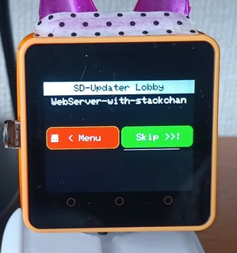

# BinsPack-for-StackChan-Core2

SD-Updaterに対応したスタックチャンのCore2版のBINファイル集です。 
現在は、スタックチャン用ソフト３種とmenu.binを packしています。

ソフト本体の内容は、下記のリンクをご参照ください。

## BINS

- [01-wss.bin](https://github.com/NoRi-230401/WebServer-with-stackchan) 
  WebServer-with-Stackchan

- [02-StackChan-Radiko.bin](https://github.com/NoRi-230401/SDU-M5Unified_StackChan_Radiko) 
Radiko

- [03-stackchan-bluetooth-speaker.bin](https://github.com/NoRi-230401/SDU-stackchan-bluetooth-simple) 
  Bluetooth Speaker

<b>※02および03は、robo8080さんのソフトを変更して、SD-Updaterに対応しました。</b> 
 
- [menu.bin](https://github.com/tobozo/M5Stack-SD-Updater/releases) 
SD-Updaterのランチャーソフト。 
"M5Core2-Launcher-2.0.13.bin" を "menu.bin"に名前を変更したものです。
  

## その他のファイル
- wifi.txt 
  "01-wss.bin"および "02-StackChan-Radiko.bin"で使用するWiFi設定のテンプレート・ファイル 
 
- apikey.txt 
"01-wss.bin"　ApiKey設定のテンプレート・ファイル 
  

## 対応ハードウエア
- M5Stack Core2 for AWS 
- M5Stack Core2  
- M5Stack Core2 v1.1　（未確認）  

## インストール方法
- BINファイルは、全てSD直下にコピーしてください。 
- 設定ファイル(wifi.txt等)は、必要に応じて修正してからSDにコピーしてください。 
- jpg / jsonフォルダ下のファイルをコピーするとソフト画像と説明が表示されます。 

SD-Updaterが初めての場合には、Core2本体に一度だけ、ソフトをCore2本体に書き込む必要があります。 
Githubでファイルを取得しVsCodeを使用してコンパイル後に書き込むこともできますが、 
<b>簡単なのは、M5Burnerを使用してWebServer-with-Stackchanのファームを書き込むこともできます。</b> 
一度ファームを書き込めば、あとはいつでも３つのソフト切替えることができます。 
  

## ブート時
ブート時に、SD-UpdaterのLobby画面が表示されます。 
- <b>"< menu"</b>  を押下するとソフト選択画面に移動。（次の画像） 
- <b>"Skip> >"</b> を選択または、タイムアウトで、前回起動したソフトを開始。  
 

 ランチャーが起動し、ここで、実行ソフト選択できます。 

 

  
## SD-Updaterについて
tobozoさん開発。SDに複数のBINファイルを入れて、ソフトを切替えて使用できるようになります。 

 https://github.com/tobozo/M5Stack-SD-Updater  

タカオさん、2023/7/29 ｽﾀｯｸﾁｬﾝ お誕生日会 2023のLTで、M5Stack-SD-Updaterの概要を説明した時のスライド
https://speakerdeck.com/mongonta0716/sutatukutiyandefu-shu-apuriwoqie-riti-erutekunituku